> [!warning]
> My work machines are either Linux or MacOS.  The examples you see here from the local machine (i.e. your computer) will be using the Bash command shell.  Windows users will need to adjust your slashes and maybe directory locations as appropriate.

Notes for LAMP stack creation using Digital Ocean – Instructions to recreate the color app

You will need a digitalocean.com account for this. I suggest being logged onto the account before you begin. You will also need to have purchased a domain. I am using `lamp.johnaedo.com` since I already own it and am not using it. .xyz domains are inexpensive, so you might want to consider those.

The Digital Ocean hosting will cost $6 per month, and you will need it for two months. The domain will cost something, too.

> [!information]
> My sample domain will be `lamp.johnaedo.com`.  Make sure to replace this with the domain that you purchased and will configure below.  Note that some screenshots will say `cop4331-5.com` as those are from steps provided by Dr. Leinecker for the DNS setup that didn't apply for my particular setup.
## Hosting

Make sure you are logged in to your Digital Ocean account. Go to [https://marketplace.digitalocean.com/apps/lamp](https://marketplace.digitalocean.com/apps/lamp)

### Create a LAMP Droplet

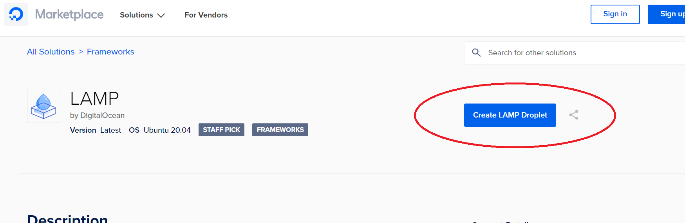


### Select Your Region and Datacenter

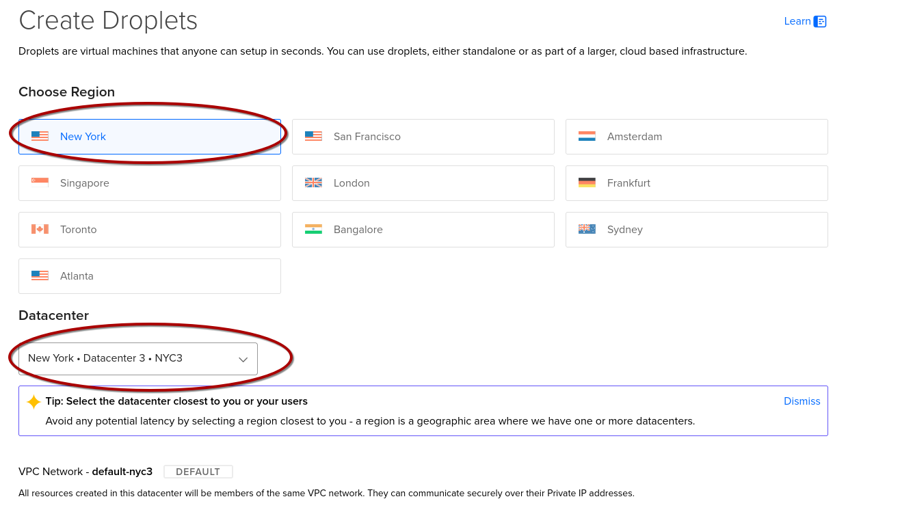

#### Scroll Down!
### Select Ubuntu, Basic Plan...

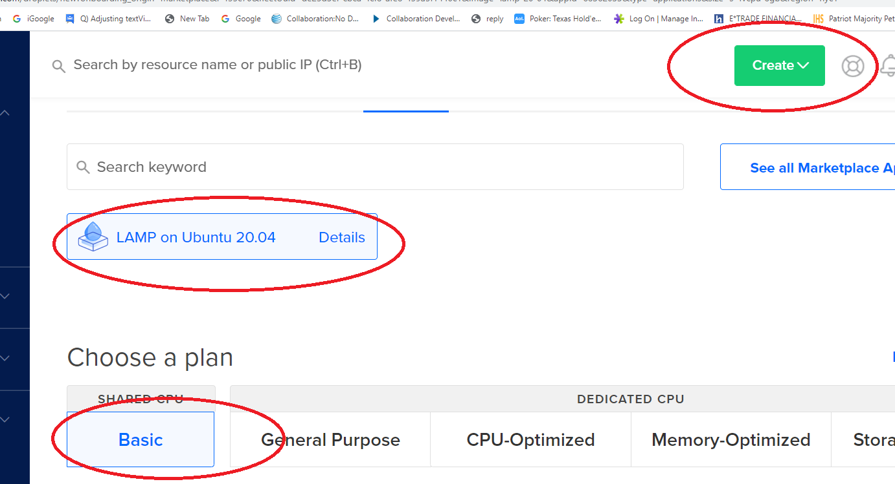

### Configure your Storage, CPU, and Transfer Plan


#### Scroll Down More!

### Configure Your Authentication
As this is the first foray into Linux and remote server access for many of you, I recommend starting simple and selecting Password.  The password you enter here will be for the `root` account for your virtual machine which will have full administrative privileges.  Follow secure password generation techniques here -- the guidelines provided are "okay," but I suggest a minimum of 16 characters.  I also recommend you read this XKCD comic for reference:  [xkcd: Password Strength](https://xkcd.com/936/)

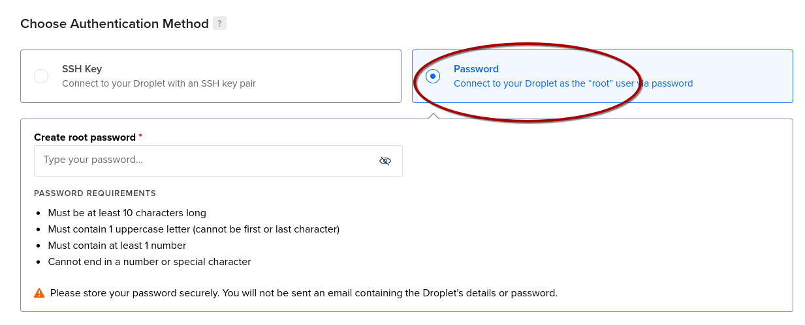
### Give Your Droplet a Name and GO!!!

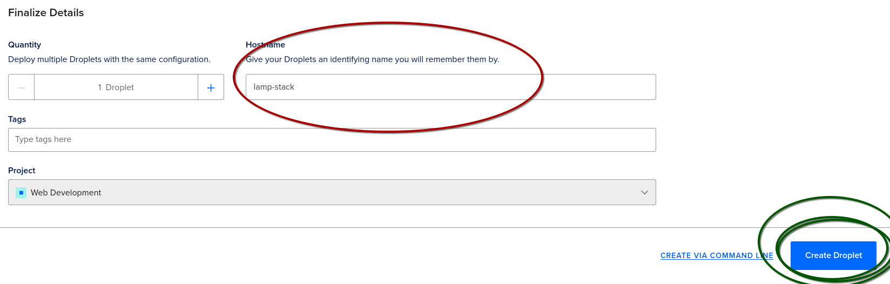

### Let's Get It Started!

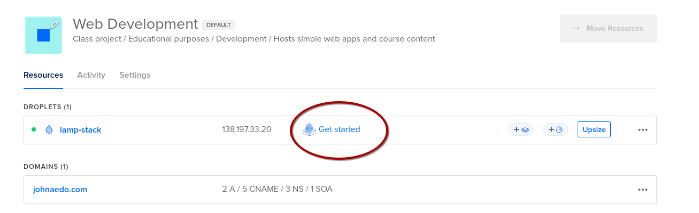

### Let's Connect

#### On Windows
You'll want to run Windows Terminal ([How to Open Terminal in Windows: Step-by-Step Guide](https://www.wikihow.com/Open-Terminal-in-Windows))
At the prompt: 
```bash
ssh root@lamp.johnaedo.com
```

#### On MacOS
CMD + Space, then type in 'terminal'
At the prompt:
```bash
ssh root@lamp.johnaedo.com
```

Then enter your password.

### Getting a Web Site Up and Running

Please note that everything you essentially need is already installed in the droplet. This includes MySQL Apache, and PHP.

Navigate to the root – 
```bash
cd /root
```

The web root is in `/var/www/html` – Go to that directory now with 
```bash
cd /var/www/html
```

View the contents of the directory with `ls`
```bash
ls
```

View the contents of `index.html` with `cat index.html` – a ton of text will scroll by.
```bash
cat index.html
```

Now we will edit the contents of index.html – open for editing with `vi index.html`
```bash
vi index.html
```


You can highlight and delete a block by positioning the cursor at the top of the block and pressing `Shift-v`, cursoring down to the end of the block and pressing `d`

You need to add the `\<body\>` tag and be in insert mode, so press the `insert` or `i` key

Your index.html file should look like the following:

```html
<html>  
 <body>  
   <h1>We love COP 4331</h1>  
 </body>  
</html>
```
To save and quit hit the `escape` key (to get out of insert mode), type `:wq` – now verify the edit with `cat index.html`
```bash
cat index.html
```

You can access this via a web browser. Open a browser and type in your URL using the IP address of the droplet you created.  Your IP address is listed on your Droplets page on Digital Ocean:

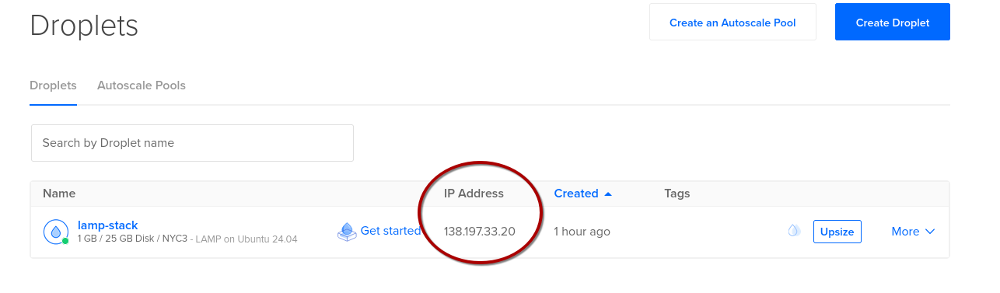

In your browser, you should now see:

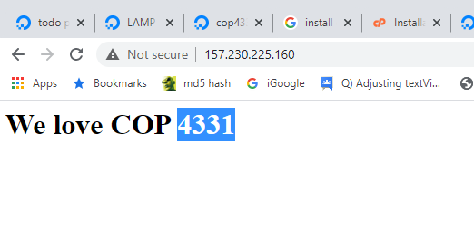

Now for a domain, since we don't want to by typing an IP address every time you access your app. You cannot buy a domain through Digital Ocean. Choose another domain registrant. The example below uses GoDaddy, but there are lots of them. Purchase a domain and point the domain to your Digital Ocean applet. Below are the steps taken on GoDaddy.


1. **I already had this domain purchased:**

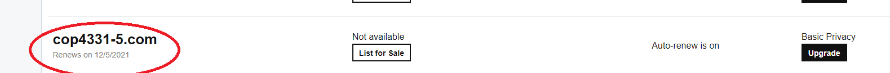

2. **Navigate to the DNS manager:**

[Open: e3b78809f94b7f7a4707b312052fee10_MD5.png](../../_assets/images/91f11f93f3b9f8724cccfaab2487c8f6_MD5.jpg)
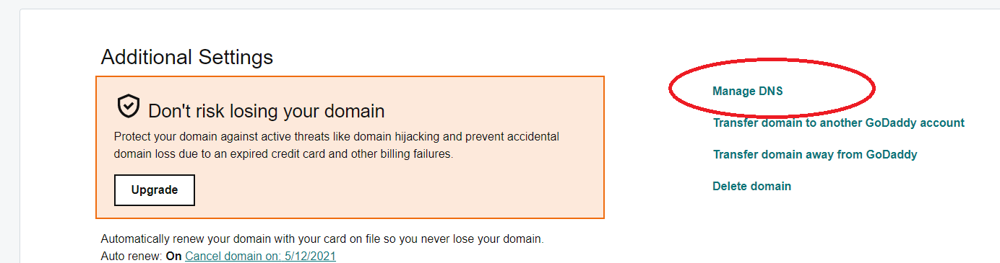

3. **Edit the IP address and save:**

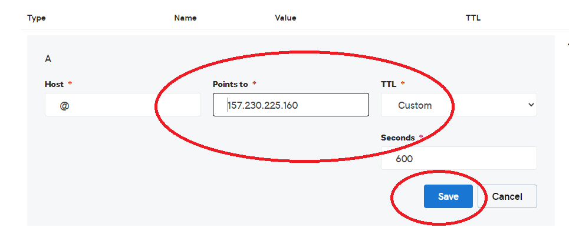

4. **Test with a browser. It might take a few minutes to propagate. (On Windows it is helpful to go to a command prompt and type ipconfig /flushdns) You might also want to use Ctrl-F5 to hard reset the web content.**  Note that on campus, DNS propagation for new URLs can take up to a full business day.  ***DO NOT attempt to configure your domain names on campus with any sort of urgency.***

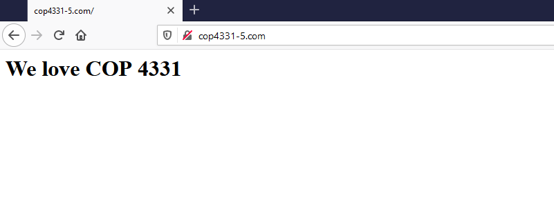

## Working with the Database (mySQL)

### Connect to mySQL and Populate a Database

```bash
mysql -u root -p (then enter your password)
```

Note: There are three levels of password you will need to think about. This is the first, which gives you access to MySQL from the command line.

Here are the steps to create the database, tables, and working data.

1. **Create database**

```
create database COP4331;
use COP4331;
```

1. **Create tables**

```sql
CREATE TABLE `COP4331`.`Users`
( 
	`ID` INT NOT NULL AUTO_INCREMENT , 
	`FirstName` VARCHAR(50) NOT NULL DEFAULT '' ,
	`LastName` VARCHAR(50) NOT NULL DEFAULT '' , 
	`Login` VARCHAR(50) NOT NULL DEFAULT '' , 
	`Password` VARCHAR(50) NOT NULL DEFAULT '' , 
	PRIMARY KEY (`ID`)
) ENGINE = InnoDB;

CREATE TABLE `COP4331`.`Colors` (
	`ID` INT NOT NULL AUTO_INCREMENT , 
	`Name` VARCHAR(50) NOT NULL DEFAULT '' , 
	`UserID` INT NOT NULL DEFAULT '0' , 
	PRIMARY KEY (`ID`)
) ENGINE = InnoDB;

CREATE TABLE `COP4331`.`Contacts`
(
	`ID` INT NOT NULL AUTO_INCREMENT ,
	`FirstName` VARCHAR(50) NOT NULL DEFAULT '' ,
	`LastName` VARCHAR(50) NOT NULL DEFAULT '' ,
	`Phone` VARCHAR(50) NOT NULL DEFAULT '' ,
	`Email` VARCHAR(50) NOT NULL DEFAULT '' ,
	`UserID` INT NOT NULL DEFAULT '0' ,
	PRIMARY KEY (`ID`)
) ENGINE = InnoDB;
```

3. **Populate working data rows**

```bash
USE COP4331;
insert into Users (FirstName,LastName,Login,Password) VALUES ('Rick','Leinecker','RickL','COP4331');
insert into Users (FirstName,LastName,Login,Password) VALUES ('Sam','Hill','SamH','Test');
insert into Users (FirstName,LastName,Login,Password) VALUES ('Rick','Leinecker','RickL','5832a71366768098cceb7095efb774f2');
insert into Users (FirstName,LastName,Login,Password) VALUES ('Sam','Hill','SamH','0cbc6611f5540bd0809a388dc95a615b');
insert into Colors (Name,UserID) VALUES ('Blue',1);
insert into Colors (Name,UserID) VALUES ('White',1);
insert into Colors (Name,UserID) VALUES ('Black',1);
insert into Colors (Name,UserID) VALUES ('Magenta',1);
insert into Colors (Name,UserID) VALUES ('Yellow',1);
insert into Colors (Name,UserID) VALUES ('Cyan',1);
insert into Colors (Name,UserID) VALUES ('Salmon',1);
insert into Colors (Name,UserID) VALUES ('Chartreuse',1);
insert into Colors (Name,UserID) VALUES ('Lime',1);
insert into Colors (Name,UserID) VALUES ('Light Blue',1);
insert into Colors (Name,UserID) VALUES ('Light Gray',1);
insert into Colors (Name,UserID) VALUES ('Light Red',1);
insert into Colors (Name,UserID) VALUES ('Light Green',1);
insert into Colors (Name,UserID) VALUES ('Chiffon',1);
insert into Colors (Name,UserID) VALUES ('Fuscia',1);
insert into Colors (Name,UserID) VALUES ('Brown',1);
insert into Colors (Name,UserID) VALUES ('Beige',1);
insert into Colors (Name,UserID) VALUES ('Blue',3);
insert into Colors (Name,UserID) VALUES ('White',3);
insert into Colors (Name,UserID) VALUES ('Black',3);
insert into Colors (Name,UserID) VALUES ('Gray',3);
insert into Colors (Name,UserID) VALUES ('Magenta',3);
insert into Colors (Name,UserID) VALUES ('Yellow',3);
insert into Colors (Name,UserID) VALUES ('Cyan',3);
insert into Colors (Name,UserID) VALUES ('Salmon',3);
insert into Colors (Name,UserID) VALUES ('Chartreuse',3);
insert into Colors (Name,UserID) VALUES ('Lime',3);
insert into Colors (Name,UserID) VALUES ('Light Blue',3);
insert into Colors (Name,UserID) VALUES ('Light Gray',3);
insert into Colors (Name,UserID) VALUES ('Light Red',3);
insert into Colors (Name,UserID) VALUES ('Light Green',3);
insert into Colors (Name,UserID) VALUES ('Chiffon',3);
insert into Colors (Name,UserID) VALUES ('Fuscia',3);
insert into Colors (Name,UserID) VALUES ('Brown',3);
insert into Colors (Name,UserID) VALUES ('Beige',3);
```

Test with:

```sql
select * from Users;
select * from Colors;
```

also:

```sql
select * from Colors where UserID=1;
select * from Colors where UserID=3;
```

### Create a Database User

> [!warning] Multiple Credentials in Play!
> Remember, there are three levels of password you will need to think about. This is the second, which allows the webapp (the API code) to run queries against MySQL.

```sql
Use COP4331;
create user 'TheBeast' identified by 'WeLoveCOP4331';
```
Now we need to grant permissions to the database for that user:

```sql
grant all privileges on COP4331.* to 'TheBeast'@'%';
```

The database is ready to use.

### The Web Site

We need to build out a directory structure to hold our application.
The directory structure looks as follows:

**root** (/var/www/html)
    `css` (/var/www/html/css)
    `images `(/var/www/html/images)
    `js` (/var/www/html/js)
    `LAMPAPI` (/var/www/html/LAMPAPI)
    `index.html`
    `color.html`

**Navigate to `/var/www/html`**

```bash
cd /var/www/html
```

**Create the directories**

```bash 
mkdir css
mkdir images
mkdir js
mkdir LAMPAPI
```

## Connecting the API to the Database

### Download the LAMP Stack Project Files from Webcourses

In Webcourses, under the `Week 1` Module, there's a file called `"LAMP Stack.zip"`  Download that to your PC.

Decompress the file.  It doesn't matter where as we'll eventually be uploading its files to the server.

### Update the Database Login Info

We need to modify three PHP files in the LAMPAPI directory that was just extracted from the LAMP Stack.zip archive: AddColor.php, Login.php, and SearchColors.php.  These files will serve as your API endpoints for accessing the database from the web application.

In each PHP file there's a line of code with your database username, password, and database name.  We need to update those placeholder values with the real values from the database setup we just completed.

The original line:
```php
$conn = new mysqli("localhost", "username", "password", "database");
```

Becomes:

```php
$conn = new mysqli("localhost", "TheBeast", "WeLoveCOP4331", "COP4331");
```

You can use whatever editor you're comfortable with to make these changes.

### Uploading the Files to the Server

Once we've updated the files, we need to upload them to our server along with the rest of our LAMP Stack package.

We're going to use SSH's cousin, `SCP`, to upload the files.
> [!note] A Word on SCP...
>In an later lesson, I will show you how to secure, contain, and protect your application...

Open your terminal...

In our example, I extracted the ZIP file to a subdirectory called `work` in my home directory: 

```bash
cd 'work/LAMP Stack/LAMPAPI'
```

Now we use SCP to copy over the files (SCP = "Secure CoPy")

```bash
scp AddColor.php root@lamp.johnaedo.com:/var/www/html/LAMPAPI
scp Login.php root@lamp.johnaedo.com:/var/www/html/LAMPAPI
scp SearchColors.php root@lamp.johnaedo.com:/var/www/html/LAMPAPI
```

Now SSH over to the server and verify the files are there.  Remember that Linux is case sensitive for file names and directories.

```bash
cd /var/www/html/LAMPAPI
ls
```

You should see output similar to this:

```bash
AddColor.php  Login.php  SearchColors.php
```


Now the API endpoints can be tested.

### Testing the API

Download the Postman application from [Download Postman | Get Started for Free](https://www.postman.com/downloads/) and install it on your computer.

Run the application:

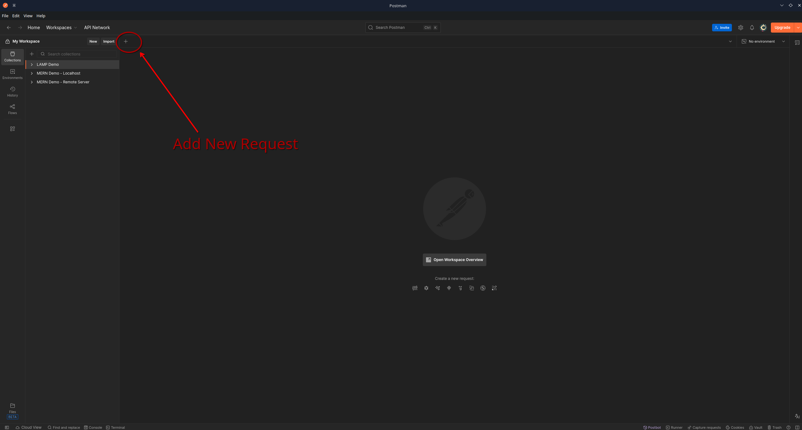

Of course your will look different from mine as I've already set up a few tests.  Also, I run Arch Linux, by the way.  You'll use the Add New Request button (highlighted above) to create tests against teach of our three end points.

Let's setup the Login endpoint test.  Click on the plus icon to add a new request.

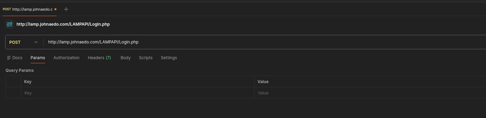

Notice that the first drop-down should list **POST**, not GET.
The URL for our POST request is http://lamp.johnaedo.com/LAMPAPI/Login.php

Now since we're logging into the app, we have to pass it our username and password.
Click on the `Body` tab and make sure that `raw` is selected.
In the text window below, you'll enter in a small snippet of [JSON](https://developer.mozilla.org/en-US/docs/Learn_web_development/Core/Scripting/JSON?%23038=) code

```json
{
	"login": "RickL",
	"password": "COP4331"
}
```

> [!note] Future use of JSON
> For your contacts app (i.e. the LAMP Stack Project) you will want to return an array of JSON objects. I have a video here: [https://www.youtube.com/watch?v=G7GTKjTLCSI](https://www.youtube.com/watch?v=G7GTKjTLCSI) that explains this.

## Setup the Front End

### Update the API URL in code.js

Your front end needs to know where your API server is so it can make data requests.
In our application, this is defined in `js/code.js`

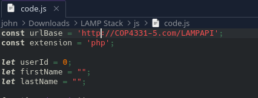

You need to update the `urlBase` variable to the location of your API.
For our example:

```js
const urlBase = 'https://lamp.johnaedo.com/LAMPAPI';
```

> [!warning] We're using HTTPS here!
> Please note the use of HTTPS instead of HTTP in this URL.  Our last step in the tutorial will be to configure the server to use encryption (HTTPS).

### Upload the Files

Using `scp` as you did earlier, upload the remaining files from `"LAMP Stack.zip"` to the server:


```bash
cd 'work/LAMP Stack'
scp css/styles.css root@lamp.johnaedo.com:/var/www/html/css

scp images/background.png root@lamp.johnaedo.com:/var/www/html/images

scp js/code.js root@lamp.johnaedo.com:/var/www/html/js
scp js/md5.js root@lamp.johnaedo.com:/var/www/html/js

scp index.html root@lamp.johnaedo.com:/var/www/html/
scp color.html root@lamp.johnaedo.com:/var/www/html/
```

If you wish to use a GUI like FileZilla, that will work as well and may be easier for you.

### Secure Your Site with TLS

Last, but definitely NOT least, we need to make sure our site supports encryption.  Nowadays, encryption is a must for privacy and security.  Even though our little apps are of little consequence, encryption is free and it's always good to reinforce good practice.

On the droplet, simple run:

```bash
certbot
```

Follow the prompts and answer the questions:

```
root@lamp-stack:~# certbot
Saving debug log to /var/log/letsencrypt/letsencrypt.log
Enter email address (used for urgent renewal and security notices)
 (Enter 'c' to cancel): john.aedo@ucf.edu

- - - - - - - - - - - - - - - - - - - - - - - - - - - - - - - - - - - - - - - -
Please read the Terms of Service at
https://letsencrypt.org/documents/LE-SA-v1.6-August-18-2025.pdf. You must agree
in order to register with the ACME server. Do you agree?
- - - - - - - - - - - - - - - - - - - - - - - - - - - - - - - - - - - - - - - -
(Y)es/(N)o: Y

- - - - - - - - - - - - - - - - - - - - - - - - - - - - - - - - - - - - - - - -
Would you be willing, once your first certificate is successfully issued, to
share your email address with the Electronic Frontier Foundation, a founding
partner of the Let's Encrypt project and the non-profit organization that
develops Certbot? We'd like to send you email about our work encrypting the web,
EFF news, campaigns, and ways to support digital freedom.
- - - - - - - - - - - - - - - - - - - - - - - - - - - - - - - - - - - - - - - -
(Y)es/(N)o: Y
Account registered.
Please enter the domain name(s) you would like on your certificate (comma and/or
space separated) (Enter 'c' to cancel): lamp.johnaedo.com
Requesting a certificate for lamp.johnaedo.com

Successfully received certificate.
Certificate is saved at: /etc/letsencrypt/live/lamp.johnaedo.com/fullchain.pem
Key is saved at:         /etc/letsencrypt/live/lamp.johnaedo.com/privkey.pem
This certificate expires on 2026-04-08.
These files will be updated when the certificate renews.
Certbot has set up a scheduled task to automatically renew this certificate in the background.

Deploying certificate
Successfully deployed certificate for lamp.johnaedo.com to /etc/apache2/sites-available/000-default-le-ssl.conf
Congratulations! You have successfully enabled HTTPS on https://lamp.johnaedo.com
```


## Testing the Complete Application

Now you can access your application by the URL `https://lamp.johnaedo.com` in your browser.  After logging in, you can see the main Colors interface:

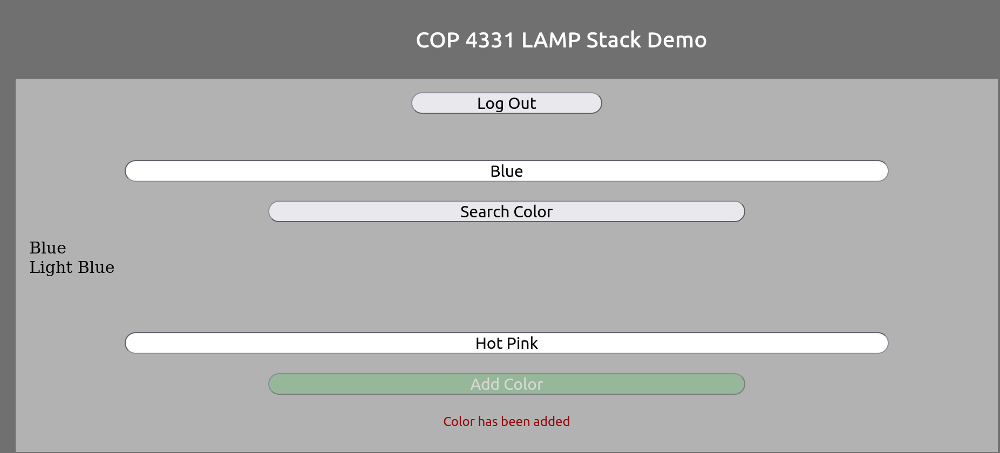

Here, I've searched for "Blue" and added "Hot Pink"

We can now search and find Hot Pink:

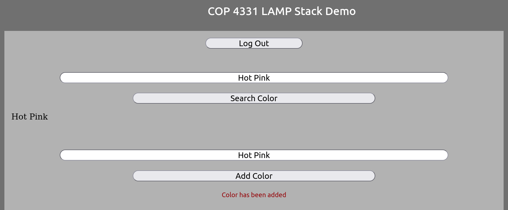

> [!tip] A Flashier Example!
> For an example of a previous project visit [http://4331paradise.com/](http://4331paradise.com/)
> 