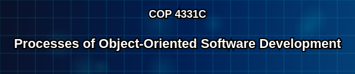

Welcome to the Processes course notes site!  This is site will contain a variety of material that is either too cumbersome or doesn't render well in Webcourses -- like any wiki-style material.  Here's a brief rundown of what's already here:

- **Code Demos and Tutorials:**  These are all the walkthroughs I've developed for our assignments and live-coding lectures.
- **Blog**:  Nothing here yet, but if I get particularly bold, it'll contain ramblings, musings, rants, and any other thoughts that pertain to this course and the field of web development.